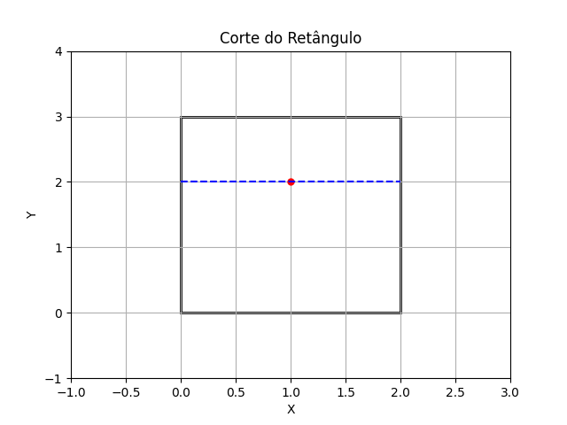
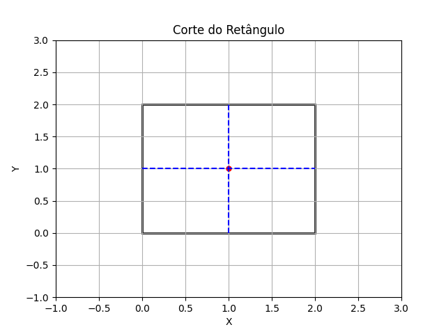

## Rectangle Cutting

**Juiz Online:** AtCoder - [https://atcoder.jp/contests/abc130/tasks/abc130_c](https://atcoder.jp/contests/abc130/tasks/abc130_c)

**Linguagem:** Python

## Descrição:

Dado um retângulo com vértices (0, 0), (W, 0), (W, H) e (0, H) e um ponto (x, y) dentro ou na borda do retângulo, determine a área máxima da menor parte que pode ser obtida ao cortar o retângulo com uma linha reta que passa por (x, y). Determine também se existe mais de uma maneira de fazer esse corte e obter a mesma área máxima.

## Solução:

**Explicação:**

1. **Casos especiais:**
   - Se o ponto (x, y) for o centro do retângulo (W/2, H/2), a área máxima da menor parte será sempre metade da área total do retângulo e haverá infinitas maneiras de cortar o retângulo para obter essa área.

2. **Cortes possíveis:**
   - Caso contrário, podemos considerar quatro cortes possíveis:
     - Uma linha vertical passando por (x, 0).
     - Uma linha horizontal passando por (0, y).
     - Uma linha vertical passando por (x, H).
     - Uma linha horizontal passando por (W, y).

3. **Calcular áreas:**
   - Calculamos a área de cada uma das duas partes geradas por cada corte.
   - Encontramos a área máxima da menor parte entre os quatro cortes.

4. **Verificar múltiplos cortes:**
   - Se a área máxima for igual à metade da área do retângulo, e o ponto (x, y) não for o centro, então há exatamente dois cortes que geram essa área (um corte vertical e um horizontal).
   - Caso contrário, há apenas um corte que gera a área máxima.

**Imagens:**

**Exemplo 1 (2 3 1 2):**



**Exemplo 2 (2 2 1 1):**



**Código:**

```python
W, H, x, y = map(int, input().split())

if 2*x == W and 2*y == H:  # (x, y) é o centro?
    print(W * H / 2, 1)  # Área máxima, múltiplos cortes possíveis
else:
    area1 = x * H 
    area2 = W * y
    area3 = (W - x) * H 
    area4 = W * (H - y)
    
    max_area = max(area1, area2, area3, area4)
    print(min(max_area, W * H / 2), 0)  # Área máxima, corte único
```

**Complexidade:**

A complexidade de tempo da solução é **O(1)**, pois realiza um número constante de operações, independentemente do tamanho da entrada.
