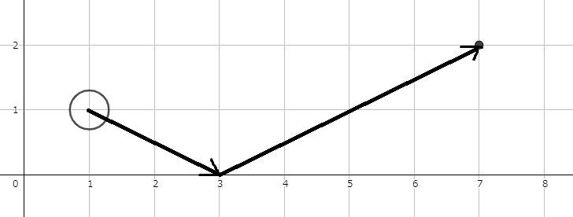
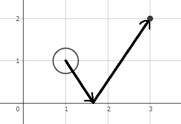

## Billiards

**Juiz Online:** AtCoder - [https://atcoder.jp/contests/abc183/tasks/abc183_b](https://atcoder.jp/contests/abc183/tasks/abc183_b)

**Linguagem:** C++

## Descrição

Em um jogo de bilhar em um plano 2D, onde o eixo X representa uma parede, a bola do jogador está em (Sx, Sy). O objetivo é fazer a bola bater no eixo X exatamente uma vez e então passar pelo ponto (Gx, Gy). A questão pede a coordenada X no eixo X (x, 0) para onde o jogador deve mirar a bola. A bola obedece à lei da reflexão (ângulo de incidência igual ao ângulo de reflexão) ao colidir com a parede.

## Solução

A solução se baseia no princípio de simetria da reflexão. 

**Imagem:**




**Explicação:**

1. **Espelhando o ponto final:** Imagine um espelho no eixo X. Se espelharmos o ponto final (Gx, Gy) em relação ao eixo X, obteremos um ponto (Gx, -Gy).

2. **Linha reta:** Se traçarmos uma linha reta do ponto inicial (Sx, Sy) até o ponto espelhado (Gx, -Gy), o ponto onde essa linha intercepta o eixo X será o ponto (x, 0) que estamos procurando.

3. **Semelhança de triângulos:** Podemos encontrar a coordenada x usando a semelhança de triângulos. Os triângulos formados pelo ponto inicial, ponto de intersecção e projeções dos pontos inicial e final no eixo X são semelhantes. Portanto:

```
(Sy / (Sx - x)) = (-Gy / (Gx - x))
```

Resolvendo para x, obtemos:

```
x = (Gx * Sy + Sx * Gy) / (Sy + Gy)
```

```c++
#include <bits/stdc++.h>

using namespace std;

int main() {
    double Sx, Sy, Gx, Gy;

    cin >> Sx >> Sy >> Gx >> Gy;

    double targetX = (Gx * Sy + Sx * Gy) / (Sy + Gy);

    cout << fixed << setprecision(10) << targetX << endl;

    return 0;
}
```

## Complexidade

A complexidade de tempo da solução é **O(1)**, pois realiza um número constante de operações para calcular a coordenada X.