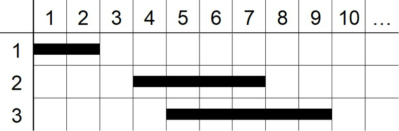

## Destroyer Takahashi

**Juiz Online:** AtCoder - [https://atcoder.jp/contests/abc230/tasks/abc230_d](https://atcoder.jp/contests/abc230/tasks/abc230_d)

**Linguagem:** Python

## Descrição:

Takahashi quer destruir N paredes em uma cidade. Cada parede i se estende da coluna Li à coluna Ri. Takahashi pode destruir D colunas consecutivas com um único soco. Encontre o número mínimo de socos que Takahashi precisa dar para destruir todas as paredes.

## Solução:

**Explicação:**

A solução utiliza um algoritmo guloso com "Sweep Line" (Varredura de Linha) da direita para a esquerda. A ideia é sempre tentar destruir o máximo de paredes possível com cada soco, priorizando as paredes com extremidade direita mais à direita.

1. **Ordenar as paredes:**
   - Ordenamos as paredes em ordem crescente de suas extremidades direitas (`Ri`).

2. **Varredura e destruição:**
   - Inicializamos uma variável `rightmost_destroyed` para rastrear a coluna mais à direita já destruída, inicialmente 0.
   - Iteramos pelas paredes na ordem ordenada:
     - Se a extremidade esquerda da parede atual (`Li`) já estiver à direita da coluna mais à direita destruída (`Li > rightmost_destroyed`), significa que precisamos de um novo soco para destruí-la.
     - Damos um soco na coluna `Ri` (extremidade direita da parede atual).
     - Atualizamos `rightmost_destroyed` para `Ri + D - 1` (a coluna mais à direita destruída por esse soco).

3. **Contagem de socos:**
   - A variável `punches` armazena o número de socos dados.

**Imagem:**



A imagem mostra um exemplo com 3 paredes e D = 3. A ordem de destruição seria: parede 3 (colunas 5-9), parede 2 (colunas 4-7), parede 1 (colunas 1-2).

**Código:**

```python
def min_punches(D, walls):
    walls.sort(key=lambda x: x[1])  # Ordenar paredes pela extremidade direita
    punches = 0
    rightmost_destroyed = 0

    for L, R in walls:
        if L <= rightmost_destroyed:  # Parede já destruída
            continue
        punches += 1
        rightmost_destroyed = R + D - 1

    return punches

N, D = map(int, input().split())
walls = [tuple(map(int, input().split())) for _ in range(N)]
result = min_punches(D, walls)
print(result)
```

## Complexidade:

* **Ordenação:** A ordenação das paredes tem complexidade **O(N log N)**, onde N é o número de paredes.
* **Varredura:** A iteração pelas paredes ordenadas tem complexidade **O(N)**.

Portanto, a complexidade de tempo total da solução é **O(N log N)**, dominada pela etapa de ordenação.
