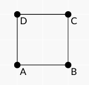
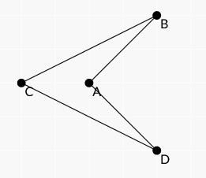

## Convex Quadrilateral

**Juiz Online:** AtCoder - [https://atcoder.jp/contests/abc266/tasks/abc266_c](https://atcoder.jp/contests/abc266/tasks/abc266_c)

**Linguagem:** Python

## Descrição:

Dado um quadrilátero no plano cartesiano, com os vértices (Ax, Ay), (Bx, By), (Cx, Cy) e (Dx, Dy) fornecidos em ordem anti-horária, determine se o quadrilátero é convexo.

## Solução:

**Explicação:**

Um quadrilátero é convexo se, e somente se, todos os seus ângulos internos forem menores que 180 graus. Podemos utilizar a classe `Polygon` (a explicação completa do código da classe `Polygon` está disponível em `Polygon.md`) e sua função `_convex` para verificar a convexidade do quadrilátero.

1. **Criar o polígono:** Criamos uma instância da classe `Polygon` com as coordenadas dos vértices do quadrilátero.
2. **Verificar a convexidade:** Chamamos a função `_convex` do objeto `Polygon` para determinar se o quadrilátero é convexo.

**Código:**

```python
# ... (código da classe Polygon em Polygon.md)

quad = [Point(list(map(int,input().split()))) for i in range(4)]
quad = Polygon(quad)

print("Yes" if quad._convex() else "No")
```

**Imagens:**

**Exemplo de quadrilátero convexo:**



**Exemplo de quadrilátero não convexo:**



**Complexidade:**

A complexidade de tempo da solução é **O(1)**, pois a função `_convex` da classe `Polygon` realiza um número constante de operações para verificar a convexidade do quadrilátero, independentemente do tamanho da entrada.