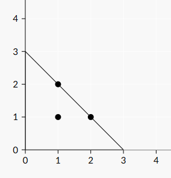

## Cover Points

**Juiz Online:** Codeforces - [https://codeforces.com/problemset/problem/1047/B](https://codeforces.com/problemset/problem/1047/B)

**Linguagem:** Python

## Descrição

Dado um conjunto de `n` pontos em um plano cartesiano, encontre o menor comprimento possível do lado menor de um triângulo isósceles que cubra todos os pontos. O triângulo deve ter dois lados coincidentes com os eixos X e Y.

## Solução

**Imagem:**




**Explicação:**

A solução se baseia na observação de que o triângulo isósceles mínimo que cobre todos os pontos terá seu vértice reto na origem (0, 0) e seus lados coincidentes com os eixos. O comprimento do lado menor será igual à maior soma das coordenadas X e Y entre todos os pontos.

1. **Iterar e encontrar o máximo:** Percorra todos os pontos, calculando a soma das coordenadas X e Y de cada ponto.
2. **Atualizar o máximo:** Armazene a maior soma encontrada até o momento.
3. **Retornar o máximo:** Após iterar por todos os pontos, a maior soma encontrada representa o comprimento mínimo do lado menor do triângulo.

```python
n = int(input())
soma = 0

for _ in range(n):
    x, y = map(int, input().split())
    soma = max(soma, x + y)

print(soma)
```

## Complexidade

A complexidade de tempo da solução é **O(n)**, onde `n` é o número de pontos, pois iteramos por todos os pontos uma vez para encontrar a maior soma das coordenadas.
