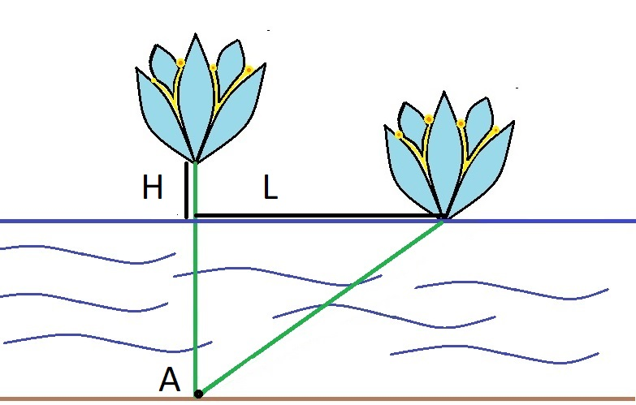

## Water Lily

**Juiz Online:** Codeforces - [https://codeforces.com/problemset/problem/1199/B](https://codeforces.com/problemset/problem/1199/B)

**Linguagem:** Python

## Descrição

Inessa está navegando em um lago e encontra um lírio d'água a uma altura H centímetros acima da superfície. Ela navega L centímetros em linha reta e, neste ponto, a flor toca a superfície da água. Sabendo que o caule do lírio está esticado e fixo no fundo do lago (ponto A), qual é a profundidade do lago no ponto A?

## Solução

**Imagem:**



**Fórmula:**

```
Profundidade (A) = (L² - H²) / (2 * H)
```

**Explicação:**

1. **Triângulo Retângulo:** A situação forma um triângulo retângulo, onde:
    - Hipotenusa: Comprimento do caule do lírio após Inessa navegar L centímetros.
    - Cateto 1:  Distância horizontal percorrida por Inessa (L).
    - Cateto 2: Profundidade do lago (A) + altura inicial da flor (H).

2. **Teorema de Pitágoras:** Aplicando o Teorema de Pitágoras:

   ```
   (A + H)² + L² = (comprimento do caule)² 
   ```

3. **Simplificando:**

   ```
   A² + 2AH + H² + L² = (comprimento do caule)²
   ```

   Como o comprimento do caule é irrelevante para a solução, podemos isolar A:

   ```
   A² + 2AH = L² - H²
   A(A + 2H) = L² - H²
   A = (L² - H²) / (2H) 
   ```

```python
print((lambda H, L: (L**2 - H**2) / (2 * H))(*map(int, input().split()))) 
```

## Complexidade

A complexidade de tempo da solução é **O(1)**, pois realiza um número constante de operações matemáticas para calcular a profundidade.