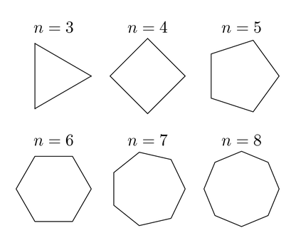

## Two Regular Polygons

**Juiz Online:** Codeforces - [https://codeforces.com/problemset/problem/1312/A](https://codeforces.com/problemset/problem/1312/A)

**Linguagem:** C

## Descrição:

Dados dois inteiros `n` e `m` (m < n), representando o número de vértices de dois polígonos regulares convexos, determine se é possível construir o polígono de `m` vértices usando apenas os vértices do polígono de `n` vértices, de forma que ambos compartilhem o mesmo centro.

## Solução:

**Explicação:**

Para que o polígono de `m` vértices possa ser construído usando os vértices do polígono de `n` vértices, `m` deve ser um divisor de `n`. Isso garante que, ao selecionarmos vértices equidistantes do polígono de `n` lados, formaremos um polígono regular de `m` lados.

**Exemplo:**



**Note**


Na imagem, podemos ver que um triângulo equilátero (3 lados) pode ser formado a partir de um hexágono regular (6 lados) selecionando vértices alternados.

**Verificação:**

Para verificar se é possível construir o polígono, basta verificar se o máximo divisor comum (MDC) entre `n` e `m` é igual a `m`. Se for, significa que `m` é um divisor de `n`.

**Código:**

```c
#include <stdio.h>

int gcd(int a, int b) {
    return b == 0 ? a : gcd( b, a%b );
}

int main(){
    int t = 0; scanf("%d",&t);
    char yes[] = "YES\n"; char no[] = "NO\n";

    while (t--)
    {
        int a,b; scanf("%d %d", &a, &b);
        printf("%s", gcd(a,b) == b ? yes : no); 
    }
}
```

**Observação:** O código utiliza a função `gcd` (máximo divisor comum) para verificar se `m` é um divisor de `n`.

## Complexidade:

A complexidade de tempo da solução é **O(t * log(min(n, m)))**, onde `t` é o número de casos de teste. Isso se deve ao loop pelos casos de teste e à complexidade da função `gcd`, que é logarítmica em relação ao menor dos dois números.
