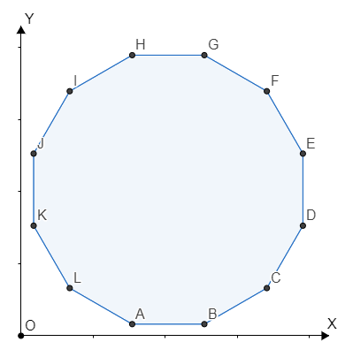

## FashionabLee

**Juiz Online:** Codeforces - [https://codeforces.com/problemset/problem/1369/A](https://codeforces.com/problemset/problem/1369/A)

**Linguagem:** C

## Descrição:

Lee quer decorar sua casa com polígonos regulares convexos. Ele considera um polígono regular de n lados "bonito" se, e somente se, ele puder rotacioná-lo de forma que pelo menos uma de suas arestas seja paralela ao eixo OX e pelo menos uma de suas arestas seja paralela ao eixo OY ao mesmo tempo. Determine se cada um dos t polígonos regulares dados é "bonito".

## Solução:

**Explicação:**

Um polígono regular convexo será "bonito" se o número de seus lados for múltiplo de 4. Isso ocorre porque:

* **Rotação de 90 graus:**  Um polígono regular com um número de lados múltiplo de 4 pode ser rotacionado em 90 graus, 180 graus e 270 graus, mantendo sua simetria.
* **Simetria e eixos:**  Nessas rotações, pelo menos uma aresta ficará paralela ao eixo OX e pelo menos uma aresta ficará paralela ao eixo OY.

**Imagem:**



A imagem mostra um hexágono regular (6 lados). Não importa como o rotacionemos, nunca conseguiremos que uma aresta fique paralela ao eixo OX e outra ao eixo OY ao mesmo tempo.

**Verificação:**

Para verificar se um polígono é "bonito", basta verificar se o número de lados é divisível por 4.

**Código:**

```c
#include <stdio.h>

int main(){
    int n = 0; scanf("%d",&n);
    char yes[] = "YES\n"; char no[] = "NO\n";

    while (n--)
    {
        int temp; scanf("%d",&temp);
        printf("%s", temp&3 ? no : yes);
    }
}
```

**Observação:** O código utiliza o operador bit a bit `&` para verificar se `temp` é divisível por 4. `temp & 3` será 0 se `temp` for múltiplo de 4, e diferente de 0 caso contrário.

## Complexidade:

A complexidade de tempo da solução é **O(t)**, onde t é o número de polígonos, pois iteramos por cada polígono uma vez para verificar se é "bonito". A verificação da divisibilidade por 4 é uma operação de tempo constante.
