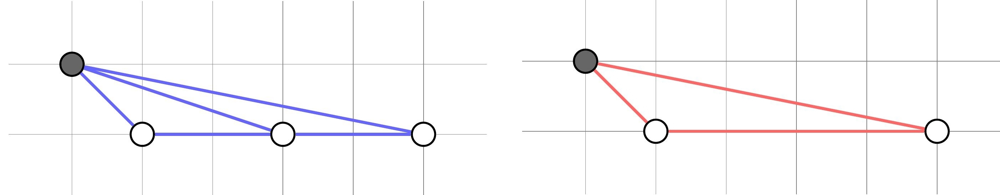

## Bovine Dilemma

**Juiz Online:** Codeforces - [https://codeforces.com/problemset/problem/1466/A](https://codeforces.com/problemset/problem/1466/A)

**Linguagem:** C++

## Descrição

Argus precisa construir um cercado triangular para sua vaca Io, usando três árvores como vértices. Existem `n` árvores localizadas em diferentes posições ao longo de um rio (eixo X) e uma árvore adicional em (0, 1). O objetivo é determinar quantas áreas distintas e não nulas o cercado pode ter.

## Solução

**Imagem:**



**Explicação:**

1. **Altura fixa:**  A altura do triângulo é sempre 1 (devido à árvore em (0, 1)).

2. **Base variável:** A base do triângulo é definida pela distância entre duas árvores no eixo X.

3. **Calcular e armazenar áreas:**
   - Iterar por todos os pares possíveis de árvores no eixo X.
   - Para cada par, calcular a base (diferença entre as coordenadas X).
   - Calcular a área do triângulo: `(base * altura) / 2`. Como a altura é 1, a área será simplesmente `base / 2`.
   - Armazenar as áreas distintas em um conjunto (para evitar repetições).

4. **Contar áreas distintas:** O tamanho do conjunto representa o número de áreas distintas.

```c++
#include <bits/stdc++.h>
using namespace std;

int main() {
    int t;
    cin >> t;

    while (t--) {
        int n;
        cin >> n;

        vector<int> x(n);
        for (int i = 0; i < n; ++i) {
            cin >> x[i];
        }

        set<double> areas;
        for (int i = 0; i < n; ++i) {
            for (int j = i + 1; j < n; ++j) {
                double base = abs(x[j] - x[i]);
                double area = 0.5 * base; // A altura é 1, podemos omitir
                areas.insert(area);
            }
        }

        cout << areas.size() << endl;
    }

    return 0;
}
```

## Complexidade

A complexidade de tempo da solução é **O(N² log N)**, onde N é o número de árvores, devido ao loop aninhado para calcular as áreas e à inserção no conjunto (que tem complexidade logarítmica). 