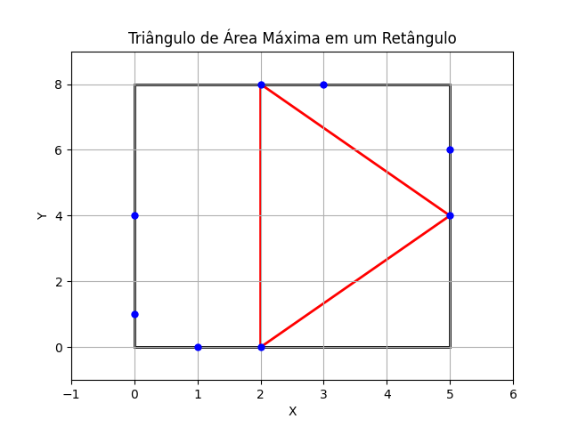

## Triangles on a Rectangle

**Juiz Online:** Codeforces - [https://codeforces.com/problemset/problem/1620/B](https://codeforces.com/problemset/problem/1620/B)

**Linguagem:** Python

## Descrição

Dado um retângulo com lados paralelos aos eixos cartesianos e cantos opostos em (0, 0) e (w, h), e uma lista de pontos nas bordas do retângulo (exceto os cantos), encontre a área máxima de um triângulo que pode ser formado escolhendo três pontos, sendo que exatamente dois pontos devem estar no mesmo lado do retângulo. **A lista de pontos em cada lado já está ordenada.**

## Solução



**Explicação:**

1. **Altura máxima:** A área de um triângulo é máxima quando sua altura é máxima. No nosso caso, a altura máxima é alcançada quando um dos lados do triângulo coincide com um dos lados do retângulo.

2. **Base máxima:** Para maximizar a área, a base do triângulo também deve ser a maior possível. A base máxima é a distância entre os dois pontos mais distantes no mesmo lado do retângulo, que já estão ordenados na entrada.

3. **Calcular e comparar áreas:**
   - **Lados horizontais:** Calcule a área máxima para os lados horizontais usando `(a[-1] - a[0]) * h`, onde `a` é a lista ordenada de coordenadas X dos pontos no lado e `h` é a altura do retângulo.
   - **Lados verticais:** Calcule a área máxima para os lados verticais usando `(a[-1] - a[0]) * w`, onde `a` é a lista ordenada de coordenadas Y dos pontos no lado e `w` é a largura do retângulo.
   - **Comparar:** Compare as quatro áreas máximas calculadas e retorne a maior.

```python
t = int(input())
for _ in range(t):
    w, h = map(int, input().split())
    area_maxima = 0

    k, *a = map(int, input().split())  # Ler pontos do lado inferior
    area_maxima = max(area_maxima, (a[-1] - a[0]) * h)
    k, *a = map(int, input().split())  # Ler pontos do lado superior
    area_maxima = max(area_maxima, (a[-1] - a[0]) * h)
    k, *a = map(int, input().split())  # Ler pontos do lado esquerdo
    area_maxima = max(area_maxima, (a[-1] - a[0]) * w)
    k, *a = map(int, input().split())  # Ler pontos do lado direito
    area_maxima = max(area_maxima, (a[-1] - a[0]) * w)

    print(area_maxima)
```

## Complexidade

A complexidade de tempo da solução é **O(n)**, onde 'n' é o número total de pontos, pois iteramos sobre a lista de pontos uma única vez para calcular as áreas máximas em cada lado.
