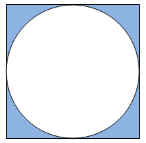

## Circle In Square

**Juiz Online:** LightOJ - [https://lightoj.com/problem/circle-in-square](https://lightoj.com/problem/circle-in-square)

**Linguagem:** Python

## Descrição:

Dado o raio de um círculo perfeitamente inscrito em um quadrado (ou seja, o círculo toca todos os lados do quadrado sem ultrapassá-los), calcule a área da região sombreada (a área do quadrado menos a área do círculo). 

**Solução:**

**Imagem:**



**Fórmulas:**

* Área do círculo:  `π * raio²`
* Lado do quadrado: `2 * raio`
* Área do quadrado: `lado²`
* Área sombreada: `Área do quadrado - Área do círculo`

**Explicação:**

1. **Calcular o lado do quadrado:** O lado do quadrado é igual ao diâmetro do círculo, que é o dobro do raio.
2. **Calcular a área do quadrado:** Eleve o lado do quadrado ao quadrado.
3. **Calcular a área do círculo:** Multiplique π (aproximadamente 3.14159) pelo quadrado do raio.
4. **Calcular a área sombreada:** Subtraia a área do círculo da área do quadrado.

```python
from math import acos

pi = 2 * acos(0.0)

n = int(input())

for i in range(1,n+1):
    r = float(input())
    square_side = 2*r

    circle_area = pi*r**2
    square_side *= square_side

    print(f"Case {i}: {(square_side-circle_area):.2f}")
```

**Complexidade:**

A complexidade de tempo da solução é **O(1)**, pois realiza um número constante de operações matemáticas para calcular a área sombreada, independentemente do tamanho da entrada.