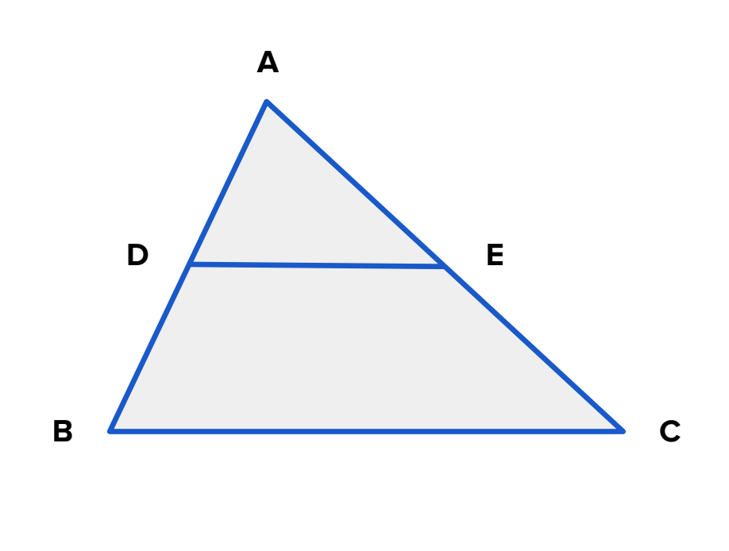

## Triangle Partitioning

**Juiz Online:** LightOJ - [https://lightoj.com/problem/triangle-partitioning](https://lightoj.com/problem/triangle-partitioning)

**Linguagem:** C++

## Descrição:

Dado um triângulo ABC, onde DE é paralelo a BC e divide o triângulo em dois triângulos menores, ADE e BDEC, encontre o valor de AD dado:

- Os comprimentos de AB, AC e BC.
- A razão entre as áreas dos triângulos ADE e BDEC (ADE / BDEC).

**Imagem:**



**Fórmula:**

* Área do triângulo (Fórmula de Heron): 
  ```
  Área = √(s(s - a)(s - b)(s - c))
  ```
  onde:
    - a, b e c são os comprimentos dos lados do triângulo.
    - s é o semiperímetro: `s = (a + b + c) / 2`

**Explicação:**

1. **Calcular a área do triângulo ABC:** Utilize a fórmula de Heron.
2. **Calcular a área do triângulo ADE:** 
   - Use a razão entre as áreas para determinar a área de ADE: `areaADE = areaABC * ratio / (ratio + 1)`. 
3. **Encontrar AD:**
   - A razão entre as áreas de triângulos semelhantes é igual ao quadrado da razão de semelhança de seus lados correspondentes: `(areaADE / areaABC) = (AD / AB)²`.
   - Isole AD da equação acima e calcule seu valor.

```c++
#include <bits/stdc++.h>

using namespace std;

int main() {
    int n;
    cin >> n;

    for (int i = 1; i <= n; ++i) {
        double AB, AC, BC, ratio;
        cin >> AB >> AC >> BC >> ratio;

        double s = (AB + AC + BC) / 2.0;
        double areaABC = sqrt(s * (s - AB) * (s - AC) * (s - BC));

        double areaADE = areaABC * ratio / (ratio + 1);

        // Relação entre áreas e lados de triângulos semelhantes
        double AD = AB * sqrt(areaADE / areaABC);

        cout << fixed << setprecision(10) << "Case " << i << ": " << AD << endl;
    }

    return 0;
}
```

**Complexidade:**

A complexidade de tempo da solução é **O(1)** por caso de teste, pois envolve apenas operações matemáticas de tempo constante.
