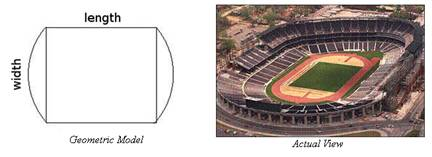

## Olympics

**Juiz Online:** LightOJ - [https://lightoj.com/problem/olympics](https://lightoj.com/problem/olympics)

**Linguagem:** Python

## Descrição:

Você está projetando uma pista de atletismo com um formato padrão: um retângulo com dois semicírculos nas extremidades. O perímetro da pista deve ser exatamente 400 metros. Dado a proporção entre o comprimento e a largura do retângulo (comprimento : largura), encontre o comprimento e a largura reais do retângulo.

**Imagem:**



**Fórmulas:**

* Perímetro do retângulo:  `2 * (comprimento + largura)`
* Circunferência do círculo: `2 * π * raio`
* Perímetro da pista: `2 * comprimento + π * largura` (largura do retângulo = diâmetro do círculo)

**Explicação:**

1. **Definir variáveis:**
   - `ratio`:  A proporção comprimento : largura (dada na entrada).
   - `comprimento`: Comprimento do retângulo (a ser encontrado).
   - `largura`: Largura do retângulo (a ser encontrado).

2. **Relação entre comprimento e largura:**
   - `comprimento = ratio * largura`

3. **Equação do perímetro:**
   - `2 * (ratio * largura) + π * largura = 400`

4. **Isolar a largura:**
   - `largura * (2 * ratio + π) = 400`
   - `largura = 400 / (2 * ratio + π)`

5. **Calcular o comprimento:**
   - `comprimento = ratio * largura`

```python
import math

t = int(input())

for i in range(1, t + 1):
    a, b = map(int, input().split(':'))
    ratio = a / b
    largura = 400 / (2 * ratio + math.pi)
    comprimento = ratio * largura
    print(f"Case {i}: {comprimento:.6f} {largura:.6f}")
```

**Complexidade:**

A complexidade de tempo da solução é **O(1)** por caso de teste, pois envolve apenas operações matemáticas de tempo constante. 
