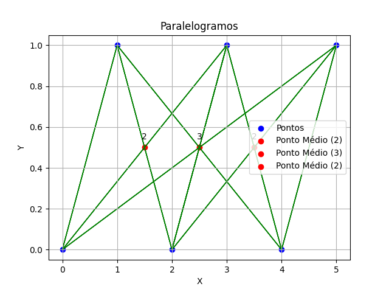

## Parallelogram Counting

**Juiz Online:** LightOJ - [https://lightoj.com/problem/parallelogram-counting](https://lightoj.com/problem/parallelogram-counting)

**Linguagem:** Python

## Descrição:

Dado um conjunto de `n` pontos distintos em um plano, encontre o número de paralelogramos que podem ser formados usando esses pontos como vértices.

## Solução:

**Imagem**




**Explicação:**

A solução se baseia na propriedade de que as diagonais de um paralelogramo se cruzam em seus pontos médios. Em vez de contar os paralelogramos diretamente, contaremos o número de vezes que o mesmo ponto médio ocorre, o que representa o número de diagonais que se cruzam naquele ponto.

1. **Calcular os pontos médios:**
   - Para cada par de pontos distintos, calcule o ponto médio de suas coordenadas: `((x1 + x2) / 2, (y1 + y2) / 2)`.
   - Armazene os pontos médios em um dicionário, onde a chave é o ponto médio e o valor é a contagem de suas ocorrências.

2. **Contar combinações:**
   - Para cada ponto médio com contagem maior que 1, significa que há múltiplas diagonais cruzando naquele ponto.
   - Calcule o número de combinações de 2 diagonais que podem ser formadas: `contagem * (contagem - 1) / 2`.
   - Some o número de combinações para todos os pontos médios.

**Código:**

```python
from typing import List
from collections import defaultdict

class Point:
    def __init__(self, x, y):
        self.x = x
        self.y = y

    def __eq__(self, other):
        return self.x == other.x and self.y == other.y

    def __hash__(self):
        return hash((self.x, self.y))

def count_parallelograms(points: List[Point]) -> int:
    n = len(points)
    midpoint_counts = defaultdict(int)
    count = 0

    for i in range(n):
        for j in range(i + 1, n):
            # Calcula o ponto médio da diagonal
            mid_x = (points[i].x + points[j].x) 
            mid_y = (points[i].y + points[j].y) 

            # Utiliza o ponto médio como chave do dicionário (representando a diagonal)
            midpoint_counts[(mid_x, mid_y)] += 1

    # Para cada ponto médio (diagonal) com contagem > 1, calcula as combinações
    for value in midpoint_counts.values():
        if value > 1:
            count += value * (value - 1) // 2  # Combinações de 2

    return count


T = int(input())

for case in range(1, T + 1):
    n = int(input())
    points = []
    for _ in range(n):
        x, y = map(int, input().split())
        points.append(Point(x, y))

    print(f"Case {case}: {count_parallelograms(points)}")
```

**Complexidade:**

A complexidade de tempo da solução é **O(N² log N)**, onde N é o número de pontos. Isso se deve ao loop aninhado para calcular todos os pontos médios e à inserção no dicionário (que possui complexidade logarítmica no pior caso).
