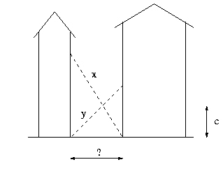

## Crossed Ladders

**Juiz Online:** LightOJ - [https://lightoj.com/problem/crossed-ladders](https://lightoj.com/problem/crossed-ladders)

**Linguagem:** C++

## Descrição:

Em uma rua estreita, duas escadas de comprimentos `x` e `y` estão apoiadas em prédios opostos, cruzando-se a uma altura `c` do chão. Determine a largura da rua.

**Imagem:**



**Explicação:**

A solução utiliza semelhança de triângulos e busca binária para encontrar a largura da rua.

1. **Semelhança de triângulos:** Observando a imagem, podemos identificar triângulos semelhantes:
   - Triângulo grande (esquerda): Catetos `a` e `h1`, hipotenusa `x`.
   - Triângulo pequeno (esquerda): Catetos `a - w` e `c`, hipotenusa `y`.

2. **Relação entre as alturas:** Usando a semelhança, temos: 
   - `h1 / x = c / (a - w)`
   - `h2 / y = c / a`

3. **Isolar 'a' e igualar:** Isolando `a` em ambas as equações e igualando, obtemos uma equação que relaciona `w`, `x`, `y`, `c`, `h1` e `h2`.

4. **Busca binária:**
   - O problema se resume a encontrar o valor de `w` (largura da rua) que satisfaça a equação.
   - Usamos busca binária no intervalo `[0, min(x, y)]` para encontrar `w`.
   - Para cada `w` testado, calculamos `h1` e `h2` usando o Teorema de Pitágoras nos triângulos menores.
   - Verificamos se a equação é satisfeita (com uma tolerância para erros de precisão).

```c++
#include <bits/stdc++.h>

using namespace std;

int main() {
  int T;
  cin >> T;

  for (int t = 1; t <= T; t++) {
    double x, y, c;
    cin >> x >> y >> c;

    double left = 0, right = min(x, y);
    for (int i = 0; i < 100; i++) {  // 100 iterações para precisão
      double mid = (left + right) / 2;

      double h1 = sqrt(x * x - mid * mid);
      double h2 = sqrt(y * y - mid * mid);

      if (h1 * h2 / (h1 + h2) < c) {
        right = mid;
      } else {
        left = mid;
      }
    }
    cout << fixed << setprecision(6) << "Case " << t << ": " << left << endl;
  }

  return 0;
}
```

**Complexidade:**

A complexidade da solução é **O(log(min(x, y)))** por caso de teste, devido à busca binária. A precisão do resultado depende do número de iterações na busca binária.

