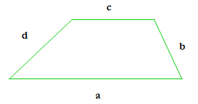

## Trapezium

**Juiz Online:** LightOJ - [https://lightoj.com/problem/trapezium](https://lightoj.com/problem/trapezium)

**Linguagem:** Python

## Descrição:

Dados os comprimentos dos quatro lados de um trapézio (a, b, c, d), onde a e c são as bases paralelas, calcule a área do trapézio.

## Solução:

**Imagem:**



**Fórmula:**

```
Área = ((a + c) / 2) * h
```

Onde:

- `a` e `c` são os comprimentos das bases paralelas.
- `h` é a altura do trapézio.

**Explicação:**

1. **Calcular a altura (h):**
   - Podemos usar o Teorema de Pitágoras para calcular a altura do trapézio. 
   - Considere um dos triângulos retângulos formados ao traçar a altura a partir de um dos vértices da base menor até a base maior.
   - A hipotenusa deste triângulo é um dos lados não paralelos (b ou d), e um dos catetos é a diferença entre as bases (a - c).
   - A altura `h` é o outro cateto, que pode ser calculado por: 

   ```
   h = sqrt(lado² - ((a - c)² + lado² - outro_lado²) / (2 * (a - c)))²)
   ```

2. **Calcular a área:**
   - Aplique a fórmula da área do trapézio: `((a + c) / 2) * h`.

**Código:**

```python
from math import sqrt

# ... (código da classe Polygon em Polygon.md) 

def area_trapezium(a: float, b: float, c: float, d: float) -> float:
    h = sqrt(b**2 - (((a - c)**2 + b**2 - d**2) / (2 * (a - c)))**2)
    area = ((a + c) / 2) * h
    return area


T = int(input())
for i in range(1, T + 1):
    a, b, c, d = map(float, input().split())
    area = area_trapezium(a, b, c, d)
    print(f"Case {i}: {area:.6f}")
```

**Complexidade:**

A complexidade de tempo da solução é **O(1)** por caso de teste, pois envolve apenas um número constante de operações matemáticas.
